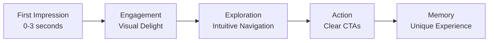

# Portfolio UI/UX Trends & Best Practices 2025

> **Comprehensive Guide for Developer & AI Portfolios**  
> Last Updated: December 21, 2025

---

## 🎯 What Makes a Portfolio UI/UX "Best in Class"

A top-tier portfolio in 2025 is not just about showcasing work—it's about creating an **immersive, memorable experience** that demonstrates your technical skills while guiding visitors toward action. Here's the formula:



---

## 🔥 Hot Trends for 2025

### 1. Interactive & Immersive Experiences

| Trend | Description | Implementation |
|-------|-------------|----------------|
| **Dynamic Cursors** | Custom cursors that morph, trail, interact | Custom JS, GSAP |
| **Scroll-Triggered Animations** | Elements animate as user scrolls | GSAP ScrollTrigger, Framer Motion |
| **Parallax Effects** | Layered movement creates depth | Locomotive Scroll, Rellax.js |
| **Gamification** | Turn browsing into interactive games | Custom implementations |

> [!TIP]
> **Your portfolio already has:** Particle.js, custom cursor, VanillaTilt. Consider upgrading to **TSParticles** for better performance and **GSAP** for premium animations.

---

### 2. Visual Design Trends

#### 🎨 Color Palettes 2025

| Style | Colors | Best For |
|-------|--------|----------|
| **Moonlit Greys** | Soft futuristic greys + bold accents | Tech/AI developers |

---

#### ✍️ Typography 2025

| Trend | Description |
|-------|-------------|
| **Variable Fonts** | Single file, multiple weights—better performance |
| **Kinetic Typography** | Moving, animated text |
| **Oversized Headlines** | Bold statement fonts |
| **Serif Revival** | Modern serifs for authenticity |
| **Liquid Chrome** | High-gloss metallic type (futuristic) |

---

#### 🌫️ Special Effects

| Effect | Description | 2025 Status |
|--------|-------------|-------------|
| **Glassmorphism** | Frosted glass with blur | ✅ Still trending |
| **Neomorphism** | Soft UI with shadows | ⚠️ Use sparingly |
| **Gradient Mesh** | Multi-dimensional color blends | 🔥 Hot trend |
| **Aurora Gradients** | Animated gradient backgrounds | 🔥 Hot trend |
| **Noise/Grain** | Subtle texture overlays | ✅ Adds depth |

```css
/* Example: Modern Glassmorphism */
.glass-card {
  background: rgba(255, 255, 255, 0.1);
  backdrop-filter: blur(10px);
  -webkit-backdrop-filter: blur(10px);
  border: 1px solid rgba(255, 255, 255, 0.18);
  border-radius: 16px;
}
```

---

### 3. Hero Section Must-Haves

The "above the fold" content is CRITICAL. Visitors decide in **0-3 seconds** whether to stay.

#### ✅ Hero Section Checklist

- [ ] **Bold headline** with clear value proposition
- [ ] **Subtitle** explaining what you do (typed effect ✓ you have this)
- [ ] **Primary CTA** - contrasting button ("View Projects" or "Let's Talk")
- [ ] **Secondary CTA** - ghost button ("Download Resume" ✓ you have this)
- [ ] **Social proof** - "Open to Opportunities" badge ✓ you have this
- [ ] **Scroll indicator** ✓ you have this


---

### 4. AI Developer Portfolio Specifics

As an AI/ML developer, your portfolio should showcase:

#### 📂 Project Case Study Structure

```markdown
## Project: [Name]

### 🎯 Problem Statement
What challenge did you solve?

### 📊 Data Pipeline
- Data sources
- Preprocessing steps
- Feature engineering

### 🧠 Model Architecture
- Algorithm selection (CNN, Transformer, RL agent, etc.)
- Training methodology
- Hyperparameter tuning

### 📈 Results & Metrics
| Metric | Value |
|--------|-------|
| Accuracy | 95.2% |
| F1 Score | 0.94 |
| Latency | 12ms |

### 🔑 Key Learnings
What would you do differently?

### 🔗 Links
[GitHub] [Live Demo] [Paper]
```

#### 🤖 AI-Specific Showcase Ideas

| Idea | Description | Implementation |
|------|-------------|----------------|
| **Data Visualization** | Interactive charts | D3.js, Plotly |
| **GitHub Stats** | Contribution graphs | GitHub API |
| **Model Cards** | ML model documentation | Standardized format |

---

### 5. Micro-Interactions & Animation

Micro-interactions make your portfolio feel **alive**. They:
- ✅ Confirm user actions
- ✅ Guide attention
- ✅ Add personality
- ✅ Reduce cognitive load

#### Must-Have Micro-Interactions

| Element | Animation | Library |
|---------|-----------|---------|
| **Buttons** | Ripple effect, scale on hover | CSS/GSAP |
| **Cards** | Subtle lift + shadow on hover | Tilt library the best one for my project |
| **Links** | Underline slide, color shift | CSS |
| **Page Transitions** | Smooth fade/slide | Barba.js |
| **Loading States** | Skeleton screens, spinners | CSS/Lottie |
| **Form Inputs** | Label float, validation feedback | CSS |
| **Scroll** | Progress bar, section indicators | IntersectionObserver |

```javascript
// Example: Magnetic Button Effect
button.addEventListener('mousemove', (e) => {
  const rect = button.getBoundingClientRect();
  const x = e.clientX - rect.left - rect.width / 2;
  const y = e.clientY - rect.top - rect.height / 2;
  
  button.style.transform = `translate(${x * 0.3}px, ${y * 0.3}px)`;
});
```

---

### 6. Accessibility (WCAG 2.2)

> [!CAUTION]
> Accessibility is not optional in 2025. Poor accessibility = legal risk + lost visitors.

#### Essential Accessibility Features

| Feature | Requirement | Your Status |
|---------|-------------|-------------|
| **Color Contrast** | 4.5:1 for normal text, 3:1 for large | ⚠️ Check dark mode |
| **Keyboard Navigation** | All interactive elements focusable | ⚠️ Missing focus states |
| **Focus Indicators** | 2-4px solid outline, 3:1 contrast | ⚠️ Needs improvement |
| **Alt Text** | All meaningful images described | ✅ Present |
| **Semantic HTML** | Proper headings, landmarks | ✅ Good structure |
| **Skip Links** | "Skip to main content" link | ❌ Missing |
| **Reduced Motion** | Respect `prefers-reduced-motion` | ⚠️ Partial |

```css
/* Essential Focus Styles */
:focus-visible {
  outline: 3px solid #7303a7;
  outline-offset: 2px;
  border-radius: 4px;
}

@media (prefers-reduced-motion: reduce) {
  *, *::before, *::after {
    animation-duration: 0.01ms !important;
    transition-duration: 0.01ms !important;
  }
}
```

---

### 7. Performance Optimization

| Metric | Target | How to Achieve |
|--------|--------|----------------|
| **LCP** | < 2.5s | Preload hero image, optimize fonts |
| **FID** | < 100ms | Minimize JS, defer non-critical |
| **CLS** | < 0.1 | Set image dimensions, stable layouts |
| **TTI** | < 3.8s | Code splitting, lazy loading |

**Your portfolio improvements:**
- ✅ You have lazy loading
- ✅ Service Worker for caching
- ⚠️ Consider: Convert images to WebP/AVIF
- ⚠️ Consider: Code-split large JS modules

---

### 8. Navigation & Layout Trends

#### 🧭 Navigation Patterns 2025

| Pattern | Description | When to Use |
|---------|-------------|-------------|
| **Sticky Minimal** | Small header on scroll | Most portfolios ✓ you have |
| **Hamburger + Overlay** | Full-screen menu on mobile | Mobile first |
| **Radial/Circular** | Experimental navigation | Creative portfolios |
| **Scroll-as-Navigation** | Sections as full pages | Single-page portfolios |
| **Command Palette** | Cmd+K search | Developer portfolios |

> [!TIP]
> Add a **command palette** (Cmd+K) to your portfolio—it's very trendy for developer sites and shows technical sophistication.

---

#### 📐 Layout Trends

| Layout | Description | Example Use |
|--------|-------------|-------------|
| **Bento Grid** | Asymmetric card layout | Skills, projects |
| **Broken Grid** | Overlapping, offset elements | Creative sections |
| **Full-Bleed Sections** | Edge-to-edge content | Hero, case studies |
| **Mega Footer** | Dense information architecture | Contact + links |

---

### 9. Dark Mode Excellence

> [!NOTE]
> 70%+ of developers prefer dark mode. Your dark mode implementation must be flawless.

#### Dark Mode Checklist

- [ ] **Sufficient contrast** - Text at least `rgba(255,255,255,0.85)`
- [ ] **Muted backgrounds** - Avoid pure black (`#000`), use `#0f0f23` or similar
- [ ] **Accent color adjustment** - Brighter for visibility
- [ ] **Image handling** - Add slight overlay or reduce brightness
- [ ] **Smooth transition** - 300ms ease for theme switch
- [ ] **Persist preference** - localStorage ✓ you have this
- [ ] **System preference detection** - `prefers-color-scheme` ✓ you have this

---

### 10. Content Strategy

#### What to Include

| Section | Priority | Details |
|---------|----------|---------|
| **Hero** | 🔴 Critical | Name, title, CTA, availability |
| **About** | 🔴 Critical | Story, personality, contact info |
| **Skills** | 🟡 Medium | Visual representation, categories |
| **Projects** | 🔴 Critical | Case studies with metrics |
| **Experience** | 🟡 Medium | Timeline, achievements |
| **Publications** | 🟢 Nice-to-have | Research, blogs, talks |
| **Testimonials** | 🟡 Medium | Social proof |
| **Contact** | 🔴 Critical | Multiple channels, form |

---

## 🛠️ Recommended Tech Stack 2025

| Category | Recommendation |
|----------|----------------|
| **Animations** | GSAP + ScrollTrigger |
| **Particles** | TSParticles (replace Particles.js) |
| **Icons** | Font Awesome 6, Lucide Icons |
| **Fonts** | Google Fonts (Inter, Outfit) |
| **Deployment** | Netlify |

---

## 🎨 Portfolio UI/UX Improvement Suggestions

---

### 🔴 Critical Improvements (High Impact)

#### 1. Add Interactive Project Case Studies
Currently projects are displayed as simple cards. Add detailed case studies showing:
- **Problem → Process → Solution flow**
- **Interactive before/after sliders**
- **Metrics/results showcase** (e.g., "Improved load time by 40%")
- This is a **2025 must-have** for developer portfolios

#### 3. Add Bento Grid Layout for Skills Section
- The current skills section uses standard cards. A **Bento grid** (asymmetric card layout) is trending in 2025
- Example: Large card for primary skill (AI/ML), medium for Python, smaller for secondary skills

---

### 🟡 Medium Priority Improvements

#### 4. Glassmorphism Cards Enhancement
- Your `variables.css` has `--bg-glass` defined but it's minimally used
- Add blur backdrop effects to cards: `backdrop-filter: blur(10px)`
- Add subtle gradient borders using `border-image`

#### 5. Hover State Micro-interactions
- Footer quick link icons
- Education quote
- Skills category headers
- Add **GSAP** or **Framer Motion**-style animations for premium feel

#### 6. Scroll-Triggered Reveal Animations
You have ScrollReveal but could enhance with:
- **Staggered card reveals**
- **Text split animations** (letter-by-letter)
- **Progress counter animations** for stats

#### 7. Dark Mode Improvements
- Current dark mode uses `#0f0f23` - consider a softer **midnight blue** (`#0d1117` like GitHub)
- Add a **contrast boost** for text: increase from `rgba(255, 255, 255, 0.75)` to `0.85`
- Add **color accent pops** in dark mode (neon accents are trending)

---

### 🟢 Quick Wins (Easy to Implement)

#### 9. Update Font Awesome to v6
- You're using **v5.15.3** - v6.5+ has better icons and smaller file sizes
- Swap Twitter icon to **"X" logo**: `fa-x-twitter`

#### 10. Add Loading Skeleton Improvements
- Your `skeleton.css` exists but could add **shimmer animations**
- Add **pulse wave effect** during content load

#### 11. Optimize Particle.js
- Consider replacing with **Vanta.js** or **TSParticles** for better performance
- Add **interactive particles** that react to cursor movement

#### 12. Contact Section Enhancement
- Add a **Calendly/Cal.com integration** for meeting booking
- Consider an **interactive world map** showing your timezone

---

### 🚀 2025 Trend Additions

#### 13. AI/LLM Project Showcase
- **Interactive ML visualization**
- **GitHub-style contribution graph**

#### 14. Add Reading Progress Indicator
- Your scroll progress exists but could be enhanced with **section indicators**
- Show **which section user is currently viewing**

#### 15. Implement Cursor Trail Effects
Enhance your existing custom cursor with:
- **Trailing particles** on movement
- **Color shifts** based on section
- **Magnetic snap to buttons** (you partially have this!)

---

## 📚 Resources

| Resource | Link |
|----------|------|
| GSAP Animation Library | https://greensock.com/gsap/ |
| TSParticles | https://particles.js.org/ |
| WCAG 2.2 Guidelines | https://www.w3.org/WAI/WCAG22/quickref/ |
| Awwwards Portfolios | https://www.awwwards.com/websites/portfolio/ |
| CSS Gradient Generator | https://cssgradient.io/ |

---

*Document created as a comprehensive reference guide. Implement incrementally based on priority.*
